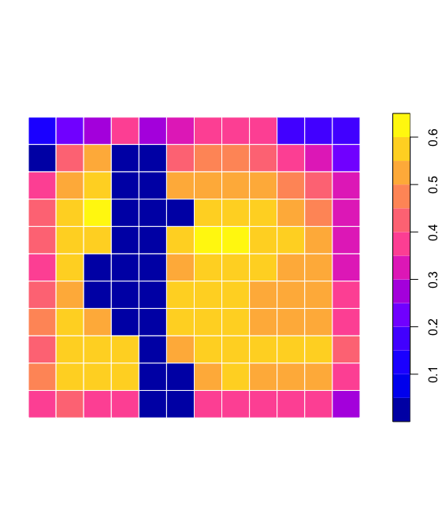

# greenSD <a href="https://github.com/billbillbilly/greenSD/"></a>

<!-- badges: start -->
[](https://lifecycle.r-lib.org/articles/stages.html#experimental)
[](https://github.com/billbillbilly/greenSD/actions/workflows/R-CMD-check.yaml)
<!-- badges: end -->

## Overview
greenSD provides tools to access and analyze multi-band greenspace 
seasonality data cubes (available for 1,028 major global cities) and 
global land cover/NDVI data from the ESA WorldCover 10m Dataset. 
Users can download data using bounding boxes, city names, or coordinates, 
extract values at specific points, and filter by year or seasonal time 
window. Moreover, the package. The package also supports calculating human 
exposure to greenspace using a population-weighted greenspace exposure model 
based on Global Human Settlement Layer (GHSL) population data and computing 
a set of greenspace morphology metrics at patch or landscape levels.

## Features
🌍 Access global greenspace datasets by bounding box, city name, or geographic coordinates
- Seasonal greenspace data cubes for 1028 major global cities
- 10m NDVI composite data from ESA WorldCover

🛰️ Remote sensing–based greenspace extraction
- Automatically download and process high-resolution images from WorldImagery or Sentinel-2 cloudless tiles (EOX)
- Extract greenery from map tiles
- Retrieve Sentinel-2 L2A imagery and compute NDVI or extract raw bands

🧠 Multi-source land cover classification
- Combine semantic segmentation and remote sensing tiles for land cover classification

🧮 Greenspace metrics calculation
- Estimate population-weighted greenspace fraction (PWGF)
- Calculate population-weighted greenspace exposure (PWGE) 
- Calculate morphological greenscape metrics (e.g., area, perimeter, shape, core area, contiguity)

📊 Visualization
- Export multi-layer data as animated GIFs

## Installation
Install the development version:
```r
# Install devtools if needed
install.packages("devtools")
# Install from GitHub
devtools::install_github("billbillbilly/greenSD")
```

## Usage

#### 1 Get data from Greenspace Seasonality Data Cube
```r
# by bounding box
gs <- greenSD::get_gsdc(place = 'Detroit', year = 2022)
# by place name
gs <- greenSD::get_gsdc(location = c(-83.10215 42.38342), year = 2022)
# by coordinates (point)
gs <- greenSD::get_gsdc(location = c(-83.10215 42.38342), year = 2022)
# by UID and time range
## greenSD::check_available_cities()
gs <- greenSD::get_gsdc(UID = 1825, year = 2022, time = c("03-01", "09-01"))

# Extract values with sampled locations
boundary <- greenSD::check_urban_boundary(uid = 1825, plot = FALSE)
samples <- sf::st_sample(boundary, size = 50)
gs_samples <- greenSD::sample_values(samples, year = 2022)
```

#### 2 Get data from ESA WorldCover 10m Annual Dataset
```r
bbox <- c(-83.087174,42.333373,-83.042542,42.358748)
ndvi <- greenSD::get_esa_wc(bbox, datatype = 'ndvi', year = 2021)
lc <- greenSD::get_esa_wc(bbox, datatype = 'landcover', year = 2021)
```

#### 3 Retrieve Sentinel-2-l2a images and compute NDVI
```r
ndvi <- greenSD::get_s2a_ndvi(place = 'New York', 
                              datetime = c("2020-08-01", "2020-09-01"), 
                              output_bands = NULL)
all_bands <- greenSD::get_s2a_ndvi(place = 'New York', 
                                   datetime = c("2020-08-01", "2020-09-01"), 
                                   output_bands = c('B01', 'B02', 'B03', 
                                                    'B04', 'B05', 'B06', 
                                                    'B07', 'B08', 'B09', 
                                                    'B11', 'B12')
                                  )
```

#### 4 Get map tiles and extract greenspace from WorldImagery or Sentinel-2 cloudless mosaic tiles
```r
greenspace <- greenSD::get_tile_green(bbox = c(-83.087174,42.333373,-83.042542,42.358748), 
                                      zoom = 15, 
                                      provider = "esri")
```

#### 5 Classify land cover based on multi-source imagery datasets
```r
sem <- greenSD::lc_sem_seg(bbox = c(-83.087174,42.333373,-83.042542,42.358748),
                           tiles = c('esri', 'eox'),
                           label_year = 2021,
                           tile_year = 2024)
```

#### 6 Compute population-weighted greenspace fraction and exposure to greenspace
```r
# Load example data (or use `gs` from previous step)
sample_data <- terra::rast(system.file("extdata", "detroit_gs.tif", package = "greenSD"))

# population-weighted greenspace fraction
pwgf <- greenSD::pop_weg(
      r = sample_data,
      pop_year = 2020,
      radius = 500)

# population-weighted greenspace exposure
pwge <- greenSD::pop_weg(
      r = sample_data,
      pop_year = 2020,
      radius = 500, 
      grid_size = 500)

```

#### 7 Compute morphology metrics of greenspace
```r
green <- greenSD::get_tile_green(bbox = c(-83.087174,42.333373,-83.042542,42.358748), 
                                 provider = "esri", 
                                 zoom = 16)
p <- terra::ifel(green$green == 0, NA, 1)
m <- greenSD::compute_morphology(r = p, directions = 8)
```

Computational process of population-weighted greenspace fraction and exposure

| <span style="font-size:10px;">1. GHSL population</span> | <span style="font-size:10px;">2. Extract population by points</span> | <span style="font-size:10px;">3. buffers based on points</span> |
|------------------------------|--------------------------------------------|-------------------------------------------|
| <figure></figure> | <figure></figure> | <figure></figure> |
| <figcaption style="font-size:8px;">Download GHSL population raster</figcaption> | <figcaption style="font-size:8px;">Convert population raster to points</figcaption> | <figcaption style="font-size:8px;">Generate 500m buffers around population points</figcaption> |

| <span style="font-size:10px;">4. Population-Weighted Greenspace Fraction</span> | <span style="font-size:10px;">5. Summarize values with grid</span> | <span style="font-size:10px;">6. Population-Weighted Greenspace Exposure</span> |
|--------------------------------------------|--------------------------------------|---------------------------------------------|
| <figure></figure> | <figure></figure> | <figure></figure> |
| <figcaption style="font-size:8px;">Compute greenspace area within each buffer and weight by population</figcaption> | <figcaption style="font-size:8px;">Generate 500m grid to aggregate data</figcaption> | <figcaption style="font-size:8px;">Summarize population-weighted greenspace fraction by grid</figcaption> |

#### 8 Visualization
The `to_gif()` function converts a multi-band raster to into an animated GIF

```r
gif <- greenSD::to_gif(
  r = sample_data,
  fps = 5,
  width = 600,
  height = 600,
  axes = FALSE,
  title_prefix = paste("greenspace - Day", 1:terra::nlyr(sample_data) * 10)
)

# Display in RStudio Viewer or save
print(gif)
# To save the GIF manually:
magick::image_write(gif, "greenspace_animation.gif")
```
Example in the Detroit area:

| Seasonal Greenspace Dynamics | Population-Weighted Greenspace Fraction | Population-Weighted Greenspace Exposure |
|------------------------------|------------------------------------------|------------------------------------------|
|  |  |  |

## Issues and bugs
If you discover a bug not associated with connection to the API that is
not already a [reported
issue](https://github.com/billbillbilly/greenSD/issues), please [open
a new issue](https://github.com/billbillbilly/greenSD/issues/new)
providing a reproducible example.

## Reference
Wu, S., Song, Y., An, J. et al. High-resolution greenspace dynamic
data cube from Sentinel-2 satellites over 1028 global major cities.
Sci Data 11, 909 (2024). https://doi.org/10.1038/s41597-024-03746-7

Chen, B., Wu, S., Song, Y. et al. Contrasting inequality in human exposure to
greenspace between cities of Global North and Global South. Nat Commun 13,
4636 (2022). https://doi.org/10.1038/s41467-022-32258-4

Pesaresi, M., Schiavina, M., Politis, P., Freire, S., Krasnodębska, K.,
Uhl, J. H., … Kemper, T. (2024). Advances on the Global Human Settlement
Layer by joint assessment of Earth Observation and population survey data.
International Journal of Digital Earth, 17(1).
https://doi.org/10.1080/17538947.2024.2390454

Zanaga, D., Van De Kerchove, R., De Keersmaecker, W., Souverijns, N.,
Brockmann, C., Quast, R., Wevers, J., Grosu, A., Paccini, A., Vergnaud, S.,
Cartus, O., Santoro, M., Fritz, S., Georgieva, I., Lesiv, M., Carter, S.,
Herold, M., Li, L., Tsendbazar, N.-E., … Arino, O. (2021).
ESA WorldCover 10 m 2020 v100 (Version v100) [Data set].
Zenodo. https://doi.org/10.5281/zenodo.5571936

Zanaga, D., Van De Kerchove, R., Daems, D., De Keersmaecker, W., Brockmann,
C., Kirches, G., Wevers, J., Cartus, O., Santoro, M., Fritz, S., Lesiv, M.,
Herold, M., Tsendbazar, N.-E., Xu, P., Ramoino, F., & Arino, O. (2022).
ESA WorldCover 10 m 2021 v200 (Version v200) [Data set].
Zenodo. https://doi.org/10.5281/zenodo.7254221
@importFrom aws.s3 get_bucket save_object
