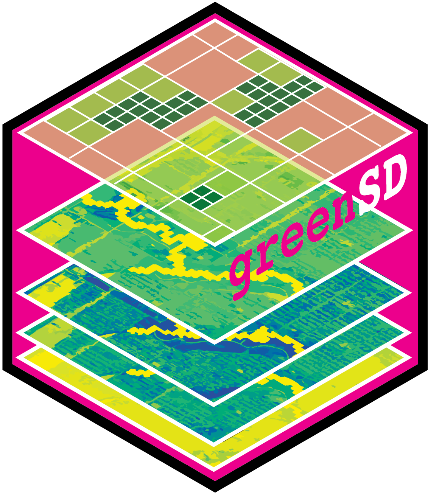
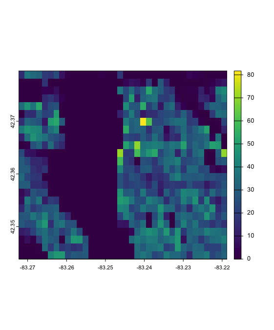
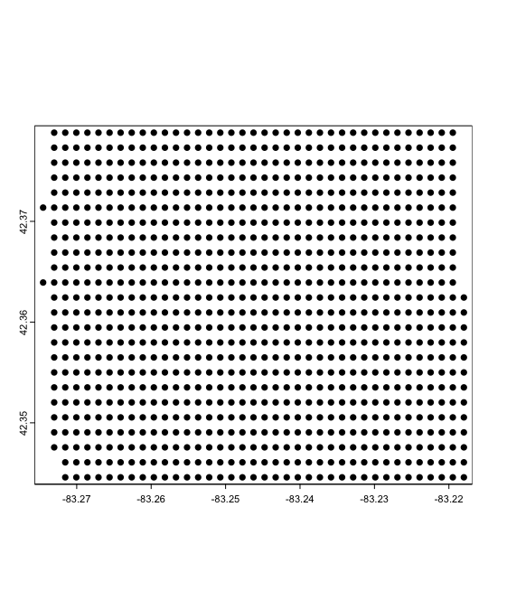
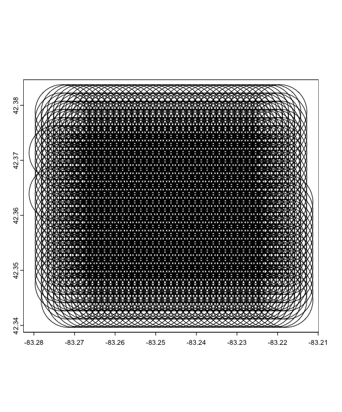
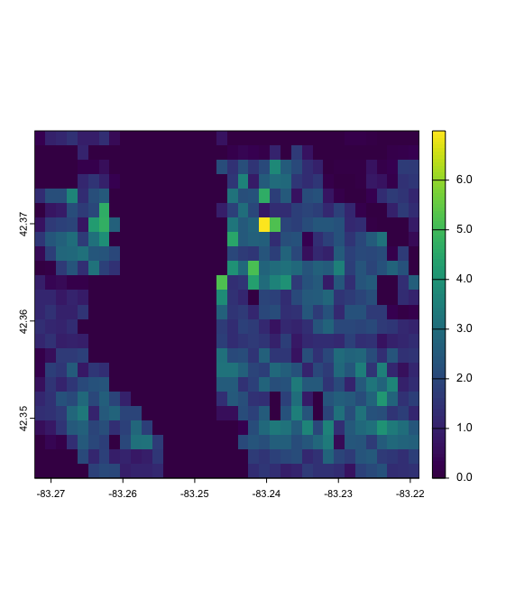
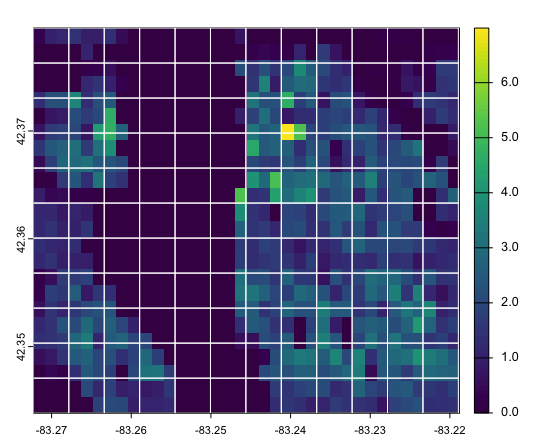
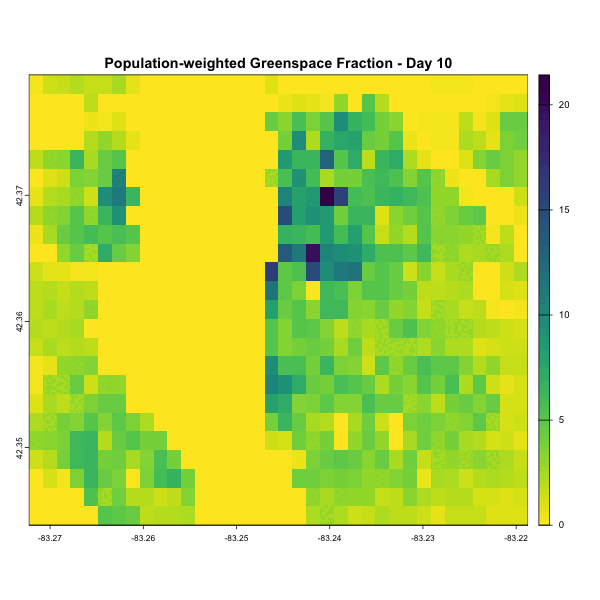

# greenSD <a href="https://github.com/billbillbilly/greenSD/"></a>

<!-- badges: start -->
[](https://lifecycle.r-lib.org/articles/stages.html#experimental)
<!-- badges: end -->

## Overview
Provides tools to access and analyze multi-band greenspace seasonality data cubes 
(available for 1,028 major global cities) and global NDVI data from the ESA 
WorldCover 10m Annual Composites Dataset. Users can download data using bounding 
boxes, city names, or coordinates, extract values at specific points, and filter 
by year or seasonal time window. The package also supports calculating human 
exposure to greenspace using a population-weighted greenspace exposure model 
based on GHSL population data.

## Features

## Installation
Install the development version:
```r
# Install devtools if needed
install.packages("devtools")
# Install from GitHub
devtools::install_github("billbillbilly/greenSD")
```

## Usage

#### 1 Get data from Greenspace Seasonality Data Cube
```r
# by bounding box
gs <- greenSD::get_gsdc_data(place = 'Detroit', year = 2022)
# by place name
gs <- greenSD::get_gsdc_data(location = c(-83.10215 42.38342), year = 2022)
# by coordinates (point)
gs <- greenSD::get_gsdc_data(location = c(-83.10215 42.38342), year = 2022)
# by UID and time range
## greenSD::check_available_cities()
gs <- greenSD::get_gsdc_data(UID = 1825, year = 2022, time = c("03-01", "09-01"))

# Extract values with sampled locations
boundary <- greenSD::check_urban_boundary(uid = 1825, plot = FALSE)
samples <- sf::st_sample(boundary, size = 50)
gs_samples <- greenSD::sample_values(samples, year = 2022)
```

#### 2 Compute population-weighted greenspace fraction and exposure to greenspace
```r
# Load example data (or use `gs` from previous step)
sample_data <- terra::rast(system.file("extdata", "detroit_gs.tif", package = "greenSD"))

pwgf <- pop_weg(
      r = sample_data,
      source = 'gsdc',
      pop_year = 2020,
      radius = 1500)

```

|       GHS population       |       Population points        |    500m buffers based on points     | 
|----------------------------|--------------------------------|-------------------------------------|-----------------------------------------|
|  |  |  | 
|----------------------------|--------------------------------|-------------------------------------|
|Population-Weighted Greenspace Fraction |  Add grid over the layer | 
|----------------------------------------|----------------------------------------|
|                    |   

#### 3 Visualization
The `to_gif()` function converts a multi-band raster to into an animated GIF

```r
gif <- greenSD::to_gif(
  r = sample_data,
  fps = 5,
  width = 600,
  height = 600,
  axes = FALSE,
  title_prefix = paste("greenspace - Day", 1:terra::nlyr(sample_data) * 10)
)

# Display in RStudio Viewer or save
print(gif)
# To save the GIF manually:
magick::image_write(gif, "greenspace_animation.gif")
```
Example in the Detroit area:

| Seasonal Greenspace Dynamics | Population-Weighted Greenspace Fraction | Population-Weighted Greenspace Exposure |
|------------------------------|------------------------------------------|------------------------------------------|
|  |  |  |

## Issues and bugs
If you discover a bug not associated with connection to the API that is
not already a [reported
issue](https://github.com/billbillbilly/greenSD/issues), please [open
a new issue](https://github.com/billbillbilly/greenSD/issues/new)
providing a reproducible example.

## Reference
Wu, S., Song, Y., An, J. et al. High-resolution greenspace dynamic
data cube from Sentinel-2 satellites over 1028 global major cities.
Sci Data 11, 909 (2024). https://doi.org/10.1038/s41597-024-03746-7
